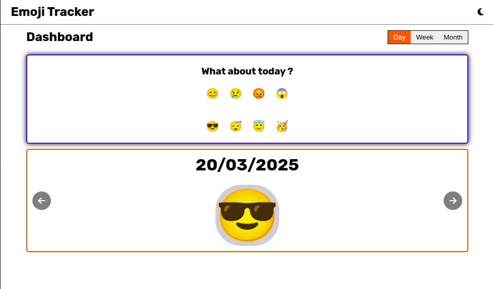
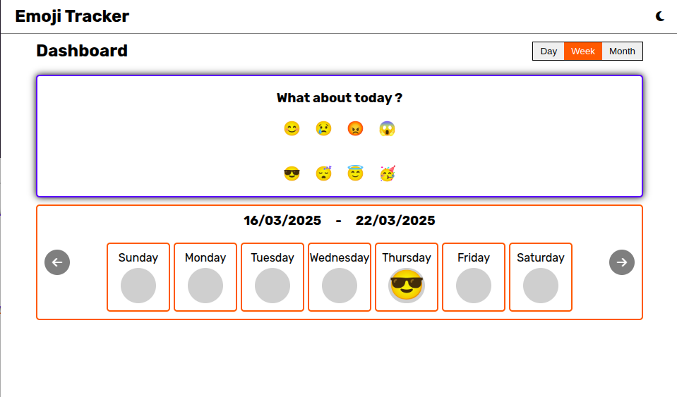
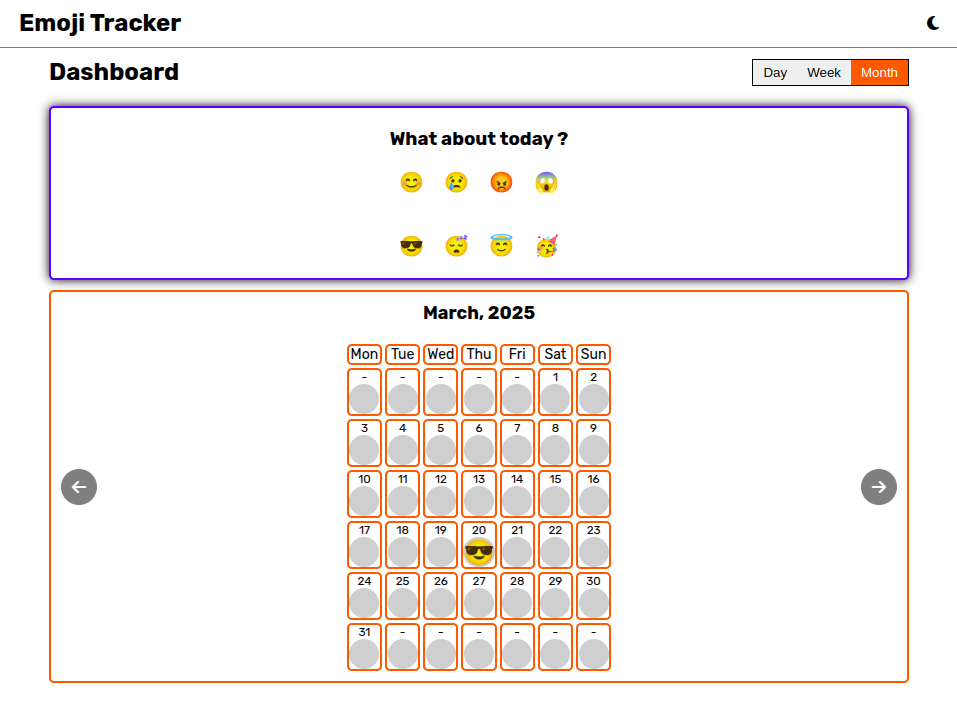
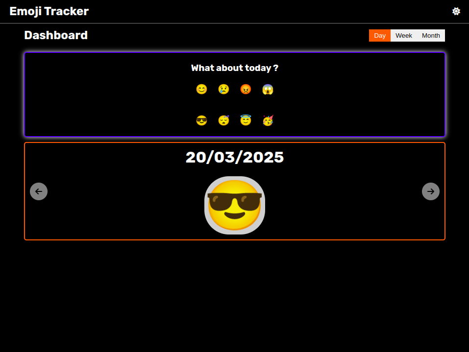

# Emoji Tracker [DEMO](https://moodtracker.unknownbug.tech/)

A simple `mood tracker` built with raw `html`,`css` and `javascript`

## Features

- Users pick a mood emoji for the day
- Store the mood logs in LocalStorage
- Display a timeline view of past moods day/week/month wise views
- Implemented calender view too

---

## Screen Shots

## 

## 

## 

